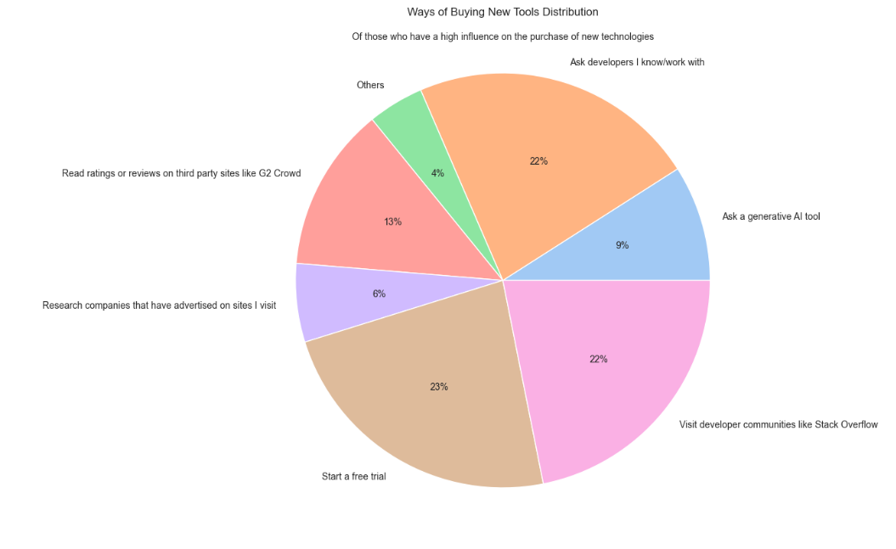
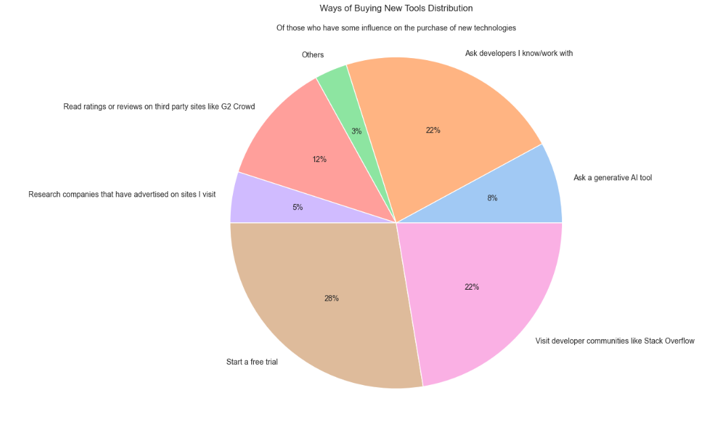
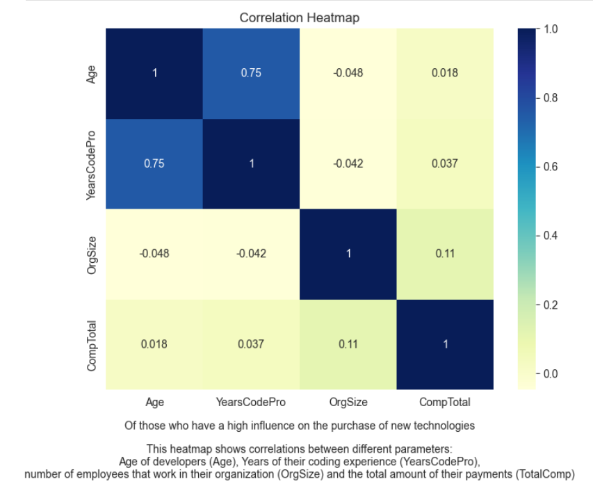
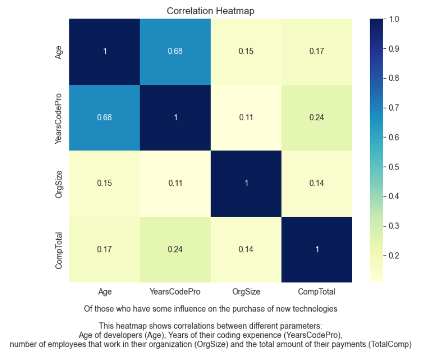

# Stack Overflow Developers Survey 2023 Project

This project includes a Exploratory Data Analysis (EDA) of responses gathered in Stack Overflow Annual Developers' Survey in May 2023. Here, we focus on **Iranian developers** who have responded to the survey and we are going to extract and visualize some useful data about developers who have a significant impact on **the purchase of new technologies** in their organization. The dataset is taken from [Stack Overflow Annual Developer Survey](https://survey.stackoverflow.co/); also, CSV files of other years from 2011 are available there.

### It is worth noting that packages `numpy`, `pandas`, `matplotlib` and `seaborn` are used from Python Data Stack.

This analysis can be valuable for those companies aiming to sell tech products to software companies and freelance developers in Iran. To achieve this goal, we will focus on three categories of questions:

- What is the education, work experience, field of work, and programming language of developers who are effective in technology purchases?
- What tools, technologies, and frameworks do these developers commonly utilize?
- When purchasing new technology products, what approaches do they use? What resources do organizations provide them?

Finally, we will try to measure meaningful correlations between several related parameters to provide more comprehensive information.

This project has four steps:

1. Importing packages and reading dataset
2. Basic exploration of data
3. Handling and visualizing data
4. Conclusion

These steps are gone through in remarkable details. For example these piecharts show appoarches developers use when trying to find the most suitable new technology:

And these are heatmaps of correlation calculated:

And this the conclusion we reachead finally:

Firstly, we know that vast majority of both groups of developers work **full-time**; second comes self-employed developers and part-time employees do not have much saying when it comes to purchasing new technologies. Moreover, the vast majority of developers fall into one of three categories: full-stack developers, back-end developers, or front-end developers. Among those with a high influence, **full-stack developers** are more prevalent, while among those with some influence, the majority are **back-end developers**. The majority of those with high influence have **eight years** of professional experience, while those with some influence typically have **five years**. Additionally, the majority of developers in both groups hold a **bachelor's degree**, followed by those with a master's degree. Individuals with higher degrees such as a Ph.D. are less common among the developers in our study. Regarding the age of developers, most fall within **the 25-34 age range**, with the 35-44 age group ranking second.

Secondly, among developers with high influence, **JavaScript**, **Python**, **HTML/CSS**, **SQL**, **TypeScript**, and **C#** are used by approximately 10%, 10%, 10%, 10%, 8%, and 6% of developers respectively. However, among developers with some influence, **JavaScript**, **HTML/CSS**, **SQL**, **Python**, **C#**, and **TypeScript** are used by almost 14%, 11%, 10%, 9%, 9%, and 8% respectively. As evident from the data, Python is more popular than HTML/CSS among the first group, while C# is more popular than TypeScript among the second group. It should be noted that **Ubuntu** has a relatively higher popularity among those with high influence compared to Windows, while among those with some influence, **Windows** has a significantly higher popularity compared to Ubuntu. **ChatGPT** and **Bing AI** are the most popular AI search tools among all developers in this analysis, with ChatGPT significantly ahead. Additionally, both those with a high and some influence use the following communication tools in order: **Telegram**, Google Meet, Skype, WhatsApp, and Discord. As evident, Telegram is highly popular among Iranian developers, while Discord, with around 10% usage, has half the popularity of Telegram.

Thirdly and most importantly, the vast majority of Iranian developers **investigate new technologies themselves** and are not given a list of them; while the most suitable approaches for them to find appropriate technologies are, in order, **using a free trial**, **exploring developer communities**, and **asking developers they personally know**.

Finally, it must be noted that correlation has only been found between the age and professional experience yeays of developers. **No simple correlations exist** between income, the number of employees in the organization, or between these two factors and the previous two. Hopefully, this analysis provides a useful initial perspective for those who intend to sell new information technology in Iran.
